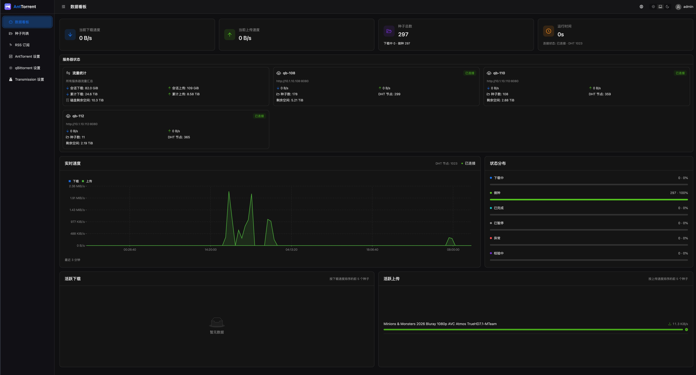
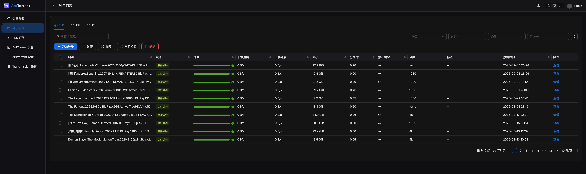
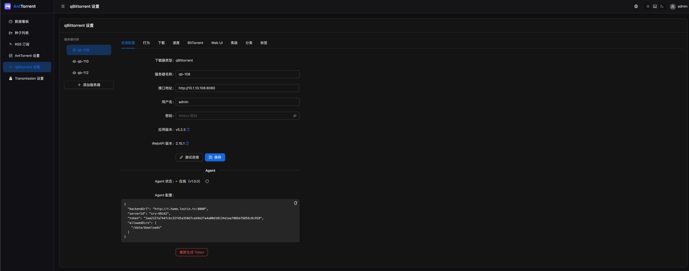
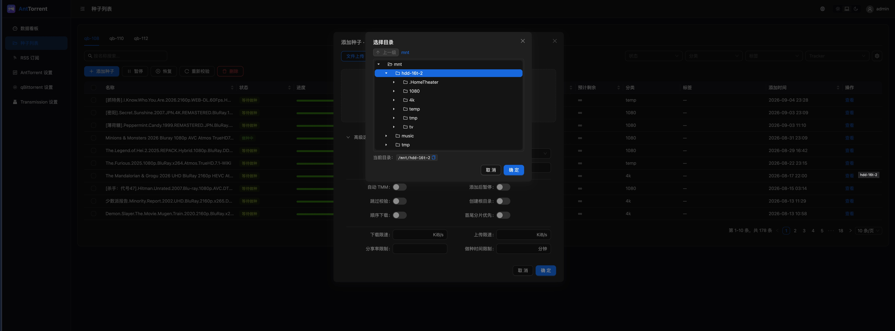

# AntTorrent

**AntTorrent** 是一个多 BT 客户端管理的 WebUI

## 特色功能

- 支持连接多个 BT 客户端，目前支持 qBittorrent, Transmission
- 通过 Agent 支持浏览 BT 客户端所在机器的目录
- 支持配置 OpenAI, Anthropic 协议的 AI 助手 _[实验性功能]_

## 常规功能

- 客户端设置，支持修改 qBittorrent, Transmission 的偏好设置
- 种子管理，支持查看种子详情、添加种子、删除种子、暂停种子、启动种子等
- 订阅管理，支持添加订阅源、查看订阅源、添加种子、删除订阅源

## 快速开始

最快的方式是 Docker Compose：

```bash
git clone <仓库地址> ant-torrent
cd ant-torrent

# 仅 Linux 需要：容器以 uid 1000 运行
mkdir -p data && sudo chown -R 1000:1000 data

docker compose up -d    # 拉取 GHCR 预构建镜像；源码构建见 docker-compose.dev.yml
```
说明：

- 首次使用需要创建管理员账号密码
- data 目录用户保存服务配置等数据，备份时备份该文件夹即可
- 更多部署方式——源码构建、systemd 服务、常见问题排查——见[安装部署指南](docs/install.md)
- **ant-agent** 安装方式见 [ant-agent 仓库](https://github.com/ant-torrent/ant-agent)

## 截图









## 许可

MIT
